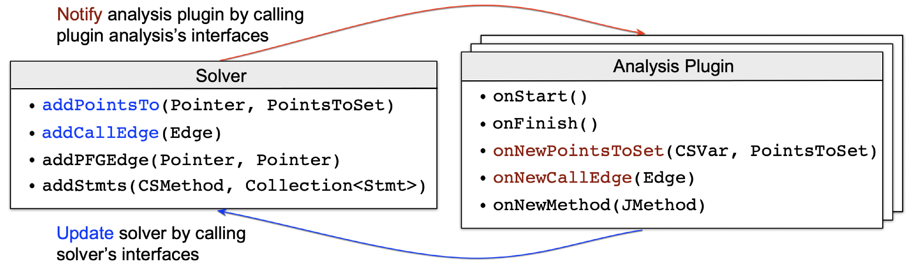

include::attributes.adoc[]

= Pointer Analysis Framework

Pointer analysis is one the most important fundamental static analyses.
Tai-e provides a versatile, efficient and extensible pointer analysis framework, which supports different kinds of heap abstraction and context sensitivity variants.
It is able to produce more sound and faster pointer analyses than other pointer analysis frameworks, under both context-insensitive and context-sensitive settings (see https://dl.acm.org/doi/pdf/10.1145/3597926.3598120[Tai-e's paper] for more details).

A distinguishing feature of our pointer analysis framework is its analysis plugin system, which enables to conveniently develop and add new analyses (that need to interact with pointer analysis) to the framework in a modular manner and make it easier to maintain and extend.
Currently, many analyses in Tai-e have been implemented as plugins of our pointer analysis framework, such as reflection analysis, lambda analysis, exception analysis, and taint analysis.

Below we introduce key options of pointer analysis and the analysis plugin system.

== Options

The analysis id of pointer analysis is `pta`, and here we list its key options:

* Context sensitivity: `cs:ci|k-[obj|type|call][-k'h]`
** Default value: `ci` (context insensitivity)
** Specify context sensitivity variant of the pointer analysis.It supports context insensitivity, and k-limiting object/type/call-site sensitivity, e.g., `1-obj` and `2-call`.By default, the limit for heap contexts is `k-1` (the recommended one).If you want to specify other limit for heap contexts, say `k'`, just append `-k'h`, e.g., `2-type-2h`.

* Only analyze application code: `only-app:[true|false]`
** Default value: `false`
** When set to `true`, the pointer analysis only analyzes application code (and ignores library code).

* Implicit entries: `implicit-entries:[true|false]`
** Default value: `true`
** Specify whether to consider the methods that are called implicitly by the JVM as entry points of the pointer analysis.When it is `false`, these methods are not considered as entry points, leading to a possibly unsound points-to result.

* String constants: `distinguish-string-constants:<strategy>`
** Default value: `reflection`
** Specify which string constants to distinguish.Currently support the following strategies:
*** `reflection`: only distinguish reflection-relevant string constants, i.e., class, method, and field names.
*** `null`: do not distinguish any string constants, i.e., merge all of them.
*** `all`: distinguish all string constants.
*** `<predicate-class>`: You could implement your strategy to distinguish string constants.
In this case, just give fully-qualified name of your predicate class here.
See https://github.com/pascal-lab/Tai-e/blob/master/src/main/java/pascal/taie/analysis/pta/core/heap/IsReflectionString.java[IsReflectionString] as an example.

* Object merging: `merge-string-objects`/`merge-string-builder`/`merge-exception-objects:[true|false]`
** Default value: `true`.
** Specify whether to merge corresponding objects.

* Advanced analysis: `advanced:<analysis>`
** Default value: `null`
** Enable advance pointer analysis technique.Currently, we have integrated following techniques:
*** Zipper-e (option value: `zipper-e`): introduced in our https://cs.nju.edu.cn/tiantan/papers/toplas2020.pdf[TOPLAS'20 paper].
*** Zipper (option value: `zipper`): introduced in our https://cs.nju.edu.cn/tiantan/papers/oopsla2018.pdf[OOPSLA'18 paper].
*** Scaler (option value: `scaler`): introduced in our https://cs.nju.edu.cn/tiantan/papers/fse2018.pdf[FSE'18 paper].
*** Mahjong (option value: `mahjong`): introduced in our https://cs.nju.edu.cn/tiantan/papers/pldi2017.pdf[PLDI'17 paper].

* Reflection log: `reflection-log:<path/to/log>`
** Default value: `null`
** Specify the path to reflection log file.
For the reflective calls specified in the log file, pointer analysis will resolve them by their targets in the log file. (currently supports the output format of https://github.com/secure-software-engineering/tamiflex[TamiFlex], and see https://github.com/pascal-lab/Tai-e/blob/master/src/test/resources/pta/reflection/ReflectiveAction.log[ReflectiveAction.log] as an example).

* Reflection inference: `reflection-inference:<strategy>`
** Default value: `string-constant`.
** Specify strategy for static reflection inference.This option can work together with `reflection-log`, and if the targets of a reflective call are given in the log, reflection inference will ignore the call.Currently support the following strategies:
*** String constant based inference (option value: `string-constant`): resolve reflective calls by string constants.
*** Solar (option value: `solar`): introduced in our https://cs.nju.edu.cn/tiantan/papers/tosem2019.pdf[TOSEM'19 paper].
*** No inference (option value: `null`): disable reflection inference.

* Taint analysis: `taint-config:<path/to/config>`
** Default value: `null`
** Specify the path to configuration file for taint analysis, which defines sources, sinks, and taint transfers.
Taint analysis will be enabled when this file is given.
See <<taint-analysis#taint-analysis,Taint Analysis>> for more details.

* Plugins: `plugins:[<pluginClass>,...]`
** Default value: `[]`
** Activate plugins.To enable a plugin, just add fully-qualified name of the plugin class to this list.

* Dump points-to results (without context information): `dump-ci:[true|false]`
** Default value: `false`
** Specify whether to dump points-to results.

* Dump points-to results (with context information): `dump:[true|false]`
** Default value: `false`
** Specify whether to dump points-to results.

* Time limit: `time-limit:<time-limit>`
** Default value: `-1`
** Specify a time limit for pointer analysis (unit: second).When it is `-1`, there is no time limit.

== Analysis Plugin System

We explain how this analysis plugin system works.As shown in figure below:

The analysis plugin system includes a pointer analysis solver (`pascal.taie.analysis.pta.core.solver.Solver`) and a number of analyses that communicate with it.Each of these analyses is referred to as an analysis plugin that needs to implement interface `pascal.taie.analysis.pta.plugin.Plugin`.The interactions between pointer analysis solver and analysis plugin are carried out by calling each other's APIs of `Solver` and `Plugin`, which are highlighted in *blue* and *red*, respectively.The `Solver` APIs have been implemented in the framework, and developers only need to implement the related APIs of `Plugin`, which are invoked by `Solver` at different stages (e.g., initialization and finishing) or on different events (e.g., discovery of new points-to relations and call edges).The additional auxiliary APIs, e.g., `Solver.addStmts()` and `Plugin.onNewMethod()`, are optional and designed to make it easier to implement specific analysis logics.

Let us briefly illustrate the basic working mechanism that drives those core APIs.
Assuming you are implementing the `onNewPointsToSet()` method of an analysis `Plugin`, this means whenever an interested variable's (parameter `CSVar`) points-to set (parameter `PointsToSet`) is changed (i.e., it points to more objects), you need to encode your logic to reflect the side effect made by this change; the final consequence of such an effect, from the perspective of pointer analysis, is to modify the points-to set of any related pointers or to add call graph edges at pertinent call sites.
Accordingly, you should call `Solver.addPointsTo()` or `Solver.addCallEdge()` to alert the solver of these modifications.
Conversely, during each analysis iteration, the solver calls `Plugin.onNewPointsToSet()` and `Plugin.onNewCallEdge()` of every plugin to notify them of any changes to the variables' points-to sets or call graph edges, respectively.
As a result, to add a new analysis that interacts with pointer analysis, developers just need to implement a few methods of `Plugin` in accordance with the requirement, as previously described.

This analysis plugin system is currently being used by a number of ongoing internal projects implemented by different developers (these projects will be released when finished), and the feedback from developers is very promising: everyone agrees that it can fulfill their practical needs and is simple to understand and apply.
For more details of the analysis plugin system, please see Section 4.1 of https://dl.acm.org/doi/pdf/10.1145/3597926.3598120[Tai-e's paper] and the source code (specifically, the interfaces `Plugin` and `Solver`, which are self-documenting).

== An Example of Plugin

We use an example to illustrate how to develop a new analysis plugin and add it to the pointer analysis framework.For simplicity, we omit the concrete analysis logics in the example.

Suppose we are implementing a taint analysis that interacts with pointer analysis.It requires following steps.

1. Create a plugin class that implements `Plugin` interface.

+
[source,java,subs="verbatim"]
----
package my.example;

public class TaintAnalysis implements Plugin {
----
+

2. Implement necessary APIs of `Plugin` with the analysis logics.

+
[source,java,subs="verbatim"]
----
    private Solver solver;

    @Override
    public setSolver(Solver solver) {
        this.solver = solver;
    }

    @Override
    public void onNewCallEdge(Edge<CSCallSite, CSMethod> edge) {
        if (/* edge target is a taint source method */) {
            Obj taint = ... // generate taint object
            // add it to points-to set of LHS variable of the call site
            solver.addPointsTo(context, lhs, heapContext, taint);
        }
    }

    @Override
    public void onFinish() {
        // collect detected taint flows and report them
    }
}
----
+

3. Activate your analysis plugin.

Analysis plugins are loaded via reflection, so that you do not need to modify existing code to integrate the plugin. Simply add the plugin class name to the `plugins` option of pointer analysis to turn it on:

[source,shell]
----
... -a pta=plugins:[my.example.TaintAnalysis];...
----

That's it! Your taint analysis will run together with the pointer analysis.
