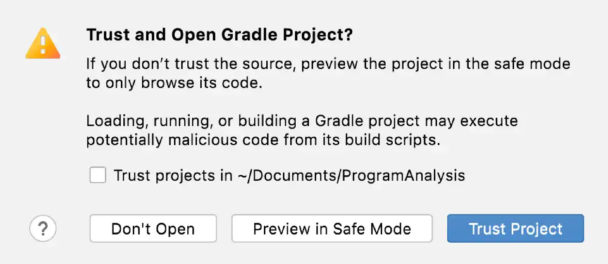
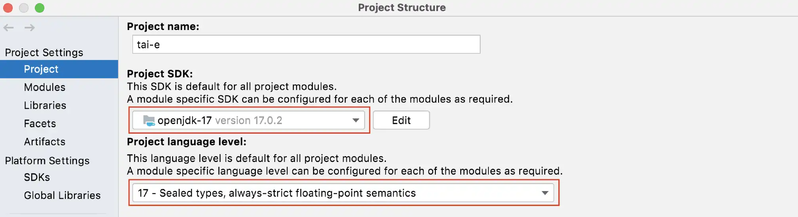
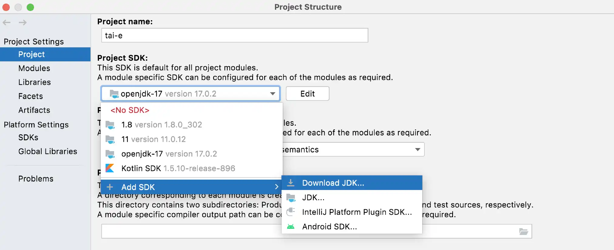
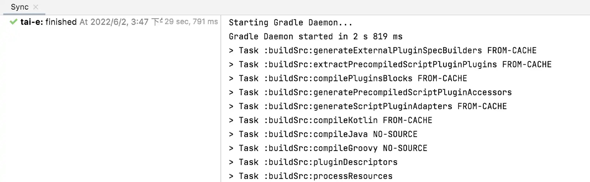
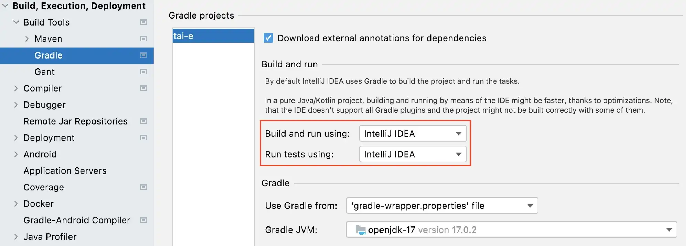
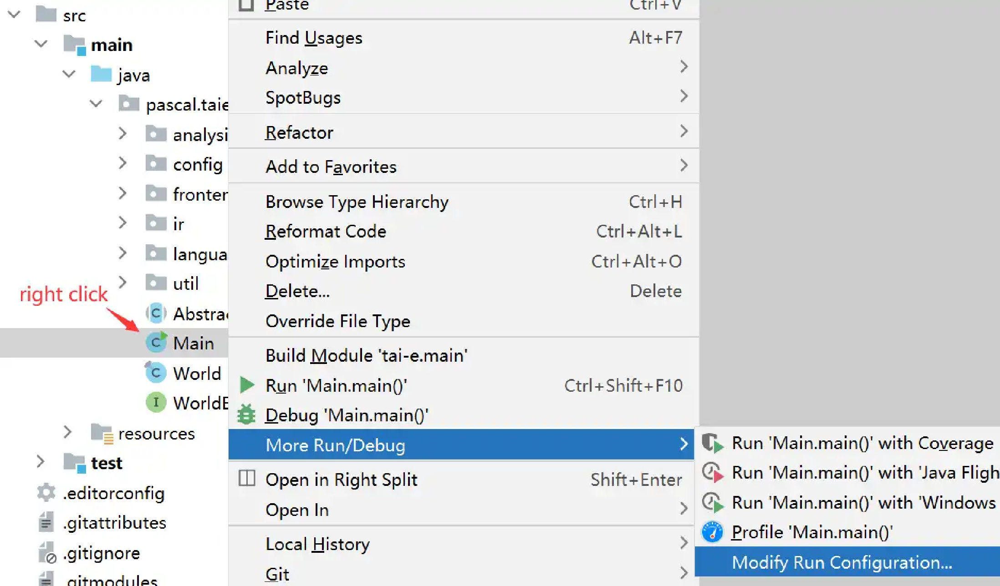

include::attributes.adoc[]

= Setup Tai-e in IntelliJ IDEA

Given the Gradle build script, setting up Tai-e in IntelliJ IDEA is easy as explained below.

== Step 0

Download IntelliJ IDEA from https://www.jetbrains.com/idea/download[`JetBrains`]. and install it. We recommend installing a recent version (2021.3 or newer) of IntelliJ IDEA for better support of Java 17.

== Step 1

Start to open a project

> *Note*: If you have already used IntelliJ IDEA, and opened some projects, then you could choose `File > Open…` to open the same dialog for the next step.

== Step 2

Select root directory of Tai-e and click "Open".

== Step 3

IntelliJ IDEA may pop up a dialog asking if you trust the Gradle project. Just click "Trust Project" (Don't worry. Tai-e is benign 😃).

You may wait a moment for importing Tai-e.

== Step 4

Go to `File > Project Structure…`, click "Project SDK", select JDK 17. Next, expand "Language level", select "SDK default" (if the default is just 17) or "17 - Sealed types, always-strict floating-point semantics":

> *Note*: If you have not installed JDK 17 yet, just select `Add SDK > Download JDK…`, and select "17" for "Version", any "Vendor" (usually "Oracle OpenJDK"), and "Location" to be installation location (default is fine), and then click "Download" to start downloading in background:

== Step 5

As Tai-e is a Gradle project, IntelliJ IDEA always builds and runs it by delegating to Gradle. However, it's important to note that the JVM used by Gradle may differ from the JVM used by the project on certain individuals' machines. To ensure consistency, just go to `File > Settings -> ...`, and change the Gradle JVM to "Project SDK":

== Step 6

To run Tai-e in IntelliJ IDEA, first choose main class of Tai-e and open "Run Configuration":

then configure program arguments as follows:

That's it! If you could finish above steps without any problems, then you have successfully setup Tai-e in IntelliJ IDEA. ヽ(｡◕‿◕｡)ﾉﾟ
